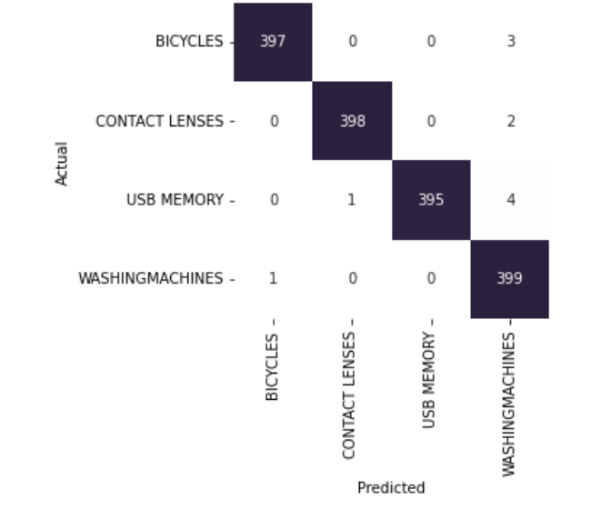
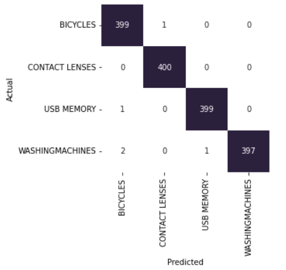

## Multilabel text classification

1. Data file you can find in `src/data` folder
2. I trained 2 models: baseline (tf-idf + catboost) and advanced (bert). All training pipeline in 
`src/train_tfidf_catboost` and `src/train_bert` notebooks
3. Confusion matrix catboost:


4. Confusion matrix bert:


5. I implemented API on flask with catboost model. To launch in use docker container:

`docker build . -t bert:latest`

`docker run -it -p 8889:8889 bert:latest`

6. Request API according to this example

```
curl --request POST 'http://localhost:8889/get-category' \
--data-raw '{
    "main_text": <some text>,
    "add_text": <some text>,
    "manufacturer": <some text>,
}'
```
